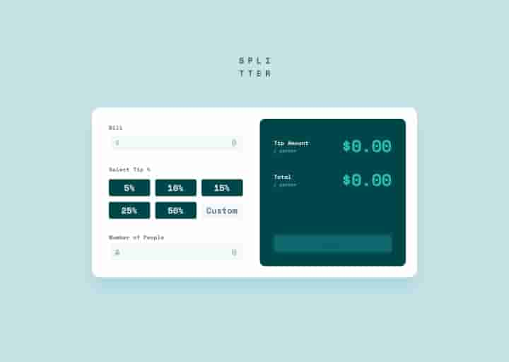

# Tip Calculator App

Un desafío interactivo para calcular propinas basado en la cantidad total de una factura, el porcentaje deseado y el número de personas que dividen la cuenta.

## Vista previa



## Descripción

Esta aplicación permite realizar cálculos de propinas y el total a pagar de manera precisa y eficiente. Los usuarios pueden ingresar:
- El monto total de la factura.
- El número de personas que dividirán la cuenta.
- Un porcentaje predefinido o personalizado de propina.

## Características

1. **Validación de entradas**:  
   - Solo se permiten números válidos en los campos de entrada.
   - Muestra errores visuales si faltan datos necesarios.

2. **Cálculos dinámicos**:  
   - Calcula la propina por persona y el total por persona al seleccionar un porcentaje predefinido o ingresar uno personalizado.

3. **Reinicio rápido**:  
   - Incluye un botón para reiniciar todos los campos y valores calculados.

## Funcionalidades clave

### 1. Validación de entradas
Se utiliza una expresión regular (`/[^0-9.]/g`) para permitir solo números y puntos decimales en los campos de entrada.

```typescript
inputBill.addEventListener("input", () => {
    inputBill.value = inputBill.value.replace(regEx, "");
    addInputBill = Number(inputBill.value);
});

inputNumberPeople.addEventListener("input", () => {
    inputNumberPeople.value = inputNumberPeople.value.replace(regEx, "");
    addInpuNumberPeople = Number(inputNumberPeople.value);
});
```

### 2. Cálculo de propina y total
La función `match` realiza los cálculos matemáticos para dividir el monto total y calcular la propina por persona.

```typescript
const match = (number: number, person: number, porcentage: number): number[] => {
    let division: number = Number((number / person));
    let porcentageOperation: number = Number((((number * porcentage) / 100) / person).toFixed(2));
    let result: number = Number((division + porcentageOperation).toFixed(2));
    return [porcentageOperation, result];
};
```

### 3. Selección de porcentaje predefinido
Los usuarios pueden seleccionar un porcentaje predefinido, que destaca visualmente el porcentaje seleccionado.

```typescript
const clicked = () => {
    porcentage.forEach(element => {
        element.addEventListener("click", () => {
            testing();
            if (!(inputBill.value === "" || inputNumberPeople.value === "")) {
                porcentage.forEach(el => el.classList.remove("porcentage-number-active"));
                element.classList.toggle("porcentage-number-active");
                clickedText = Number(element.textContent?.replace("%", ""));
                let [tipAmount, total] = match(addInputBill, addInpuNumberPeople, clickedText);
                resultTipAmount.innerHTML = `${tipAmount}`;
                resultTotal.innerHTML = `${total}`;
            }
        });
    });
};
```

### 4. Uso de porcentajes personalizados
Permite al usuario ingresar manualmente un porcentaje de propina en un campo de entrada.

```typescript
custom.addEventListener("input", () => {
    testing();
    let inputValue: number = Number(custom.value);
    if (!(inputBill.value === "" || inputNumberPeople.value === "")) {
        let [tipAmount, total] = match(addInputBill, addInpuNumberPeople, inputValue);
        resultTipAmount.innerHTML = `${tipAmount}`;
        resultTotal.innerHTML = `${total}`;
    }
});
```

### 5. Reinicio de datos
El botón de reinicio limpia todos los valores y desactiva los estilos activos.

```typescript
reset.addEventListener("click", () => {
    inputBill.value = "";
    inputNumberPeople.value = "";
    resultTipAmount.innerHTML = `0.00`;
    resultTotal.innerHTML = `0.00`;
    porcentage.forEach(el => el.classList.remove("porcentage-number-active"));
});
```

## Tecnologías utilizadas
- **HTML5**: Para la estructura del contenido.
- **CSS3**: Para estilos y diseño responsivo.
- **TypeScript**: Para lógica interactiva con tipado estático.

## Cómo usar
1. Ingresa el monto total de la factura.
2. Ingresa el número de personas que compartirán la cuenta.
3. Selecciona un porcentaje de propina predefinido o escribe uno personalizado.
4. Observa los resultados actualizados en tiempo real.
5. Usa el botón "Reset" para limpiar los datos y comenzar de nuevo.

## Instalación
1. Clona el repositorio:  
   ```bash
   git clone https://github.com/JuSeRDev/Landing-challenge-FM.git
   ```
2. Navega a la carpeta del desafío:  
   ```bash
   cd retos/reto-18
   ```
3. Abre el archivo `index.html` en tu navegador.
---

_Desafío basado en un proyecto de [Frontend Mentor](https://www.frontendmentor.io/)._
